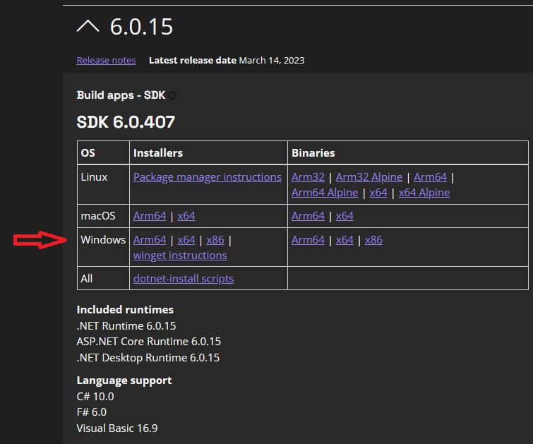
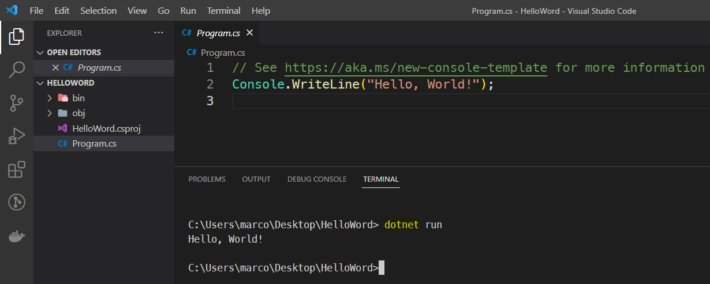
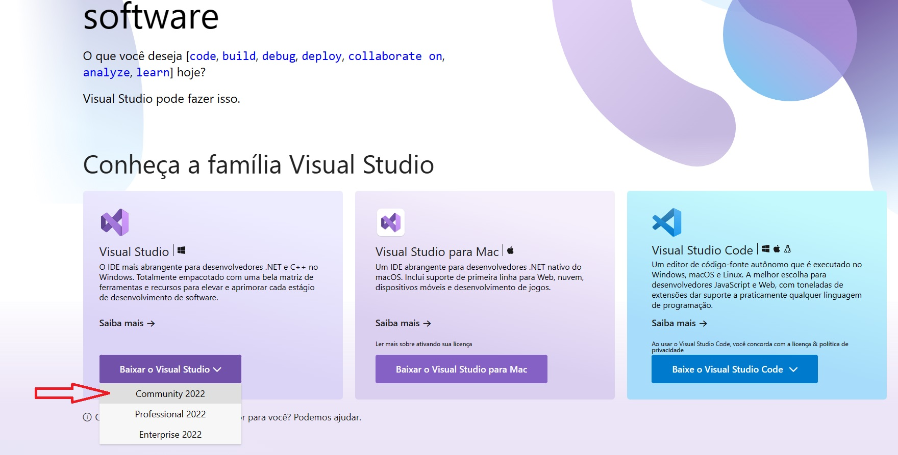
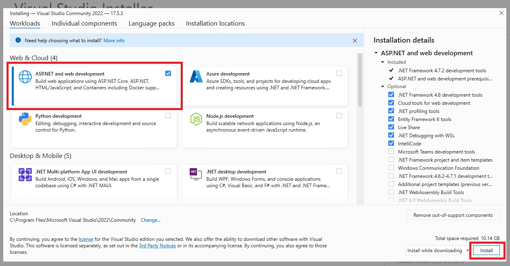
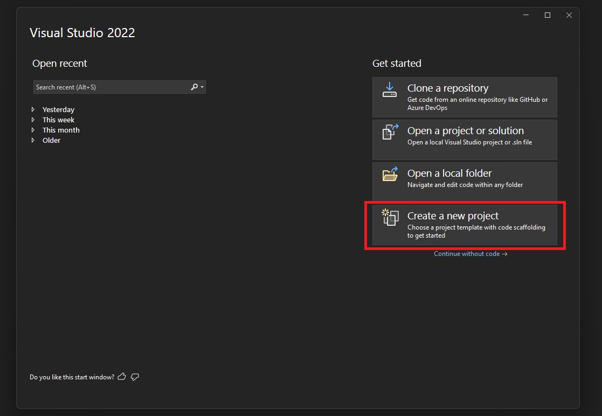
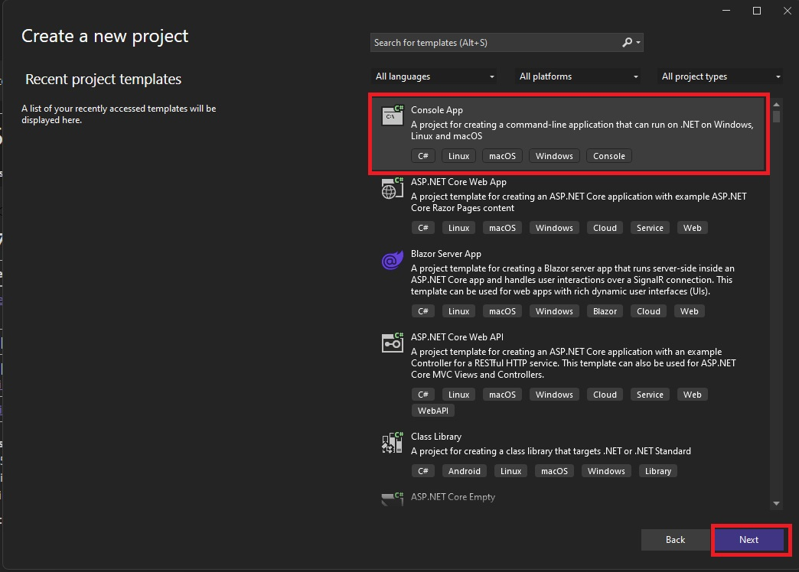
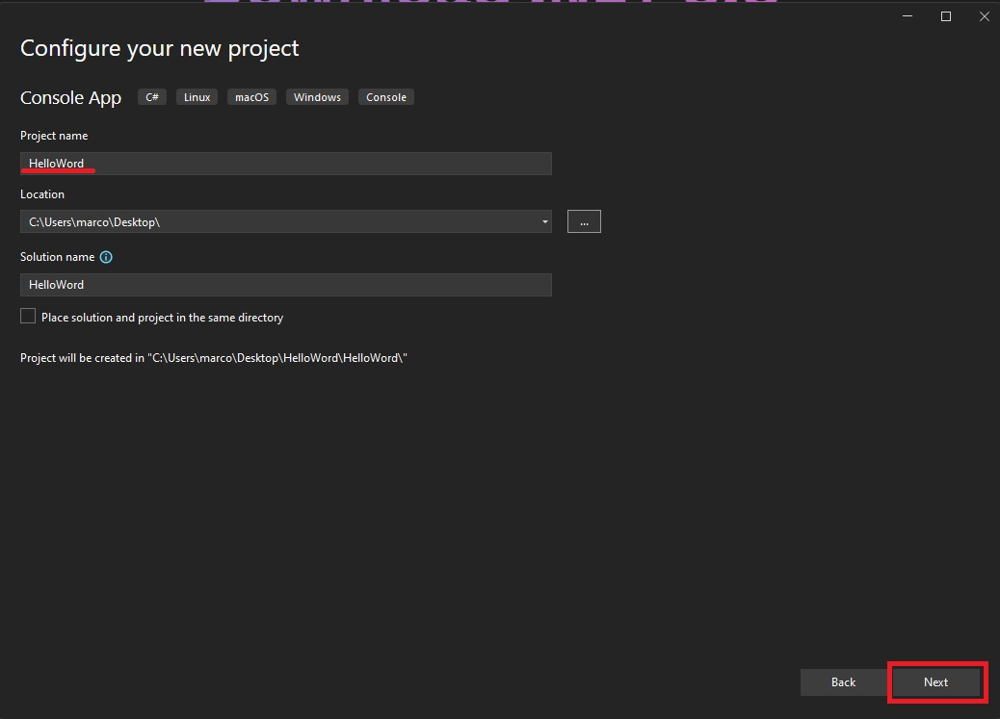
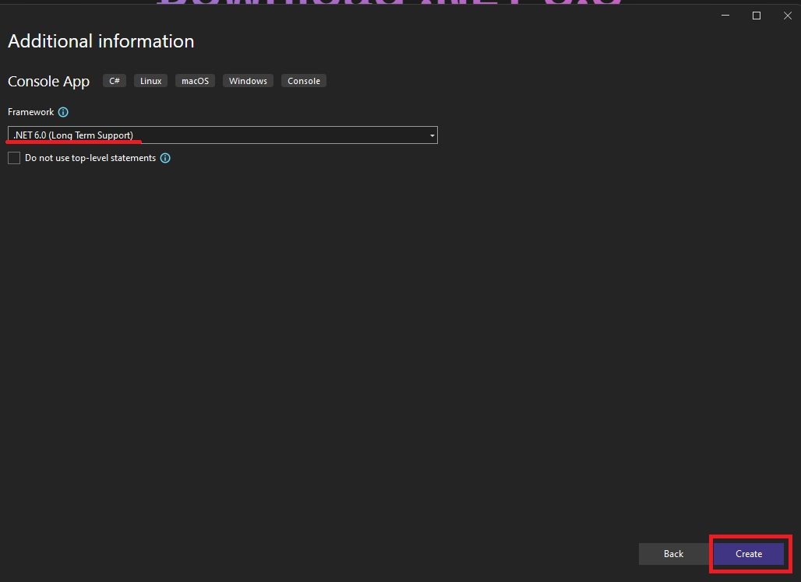
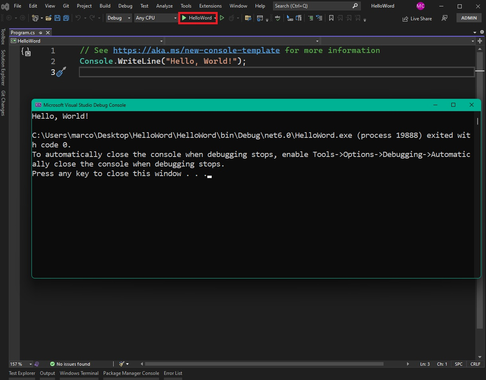

# 2.3 Sistema Windows

Para este curso, utilizaremos o [SDK](https://pt.wikipedia.org/wiki/Kit_de_desenvolvimento_de_software) do .Net no decorrer dos tópicos, e por ser multiplataforma, você pode rodar seus projetos desenvolvidos em outros sistemas, no Windows também!

## Instalando o .NET

- Entre [nesse](https://dotnet.microsoft.com/download/dotnet-core/6.0) link e baixe o instalador do [SDK](https://pt.wikipedia.org/wiki/Kit_de_desenvolvimento_de_software) do .Net para o Windows de acordo com a sua arquitetura.
    

- Para instalar, basta clicar no instalador baixado, e esperar a instalação.

- Para rodar nossos códigos desenvolvidos nesse curso, recomendamos a utilização do [Visual Studio Code (VSCode)](https://code.visualstudio.com/), por ser leve e simples de utilizar.

## Criando o projeto

Entre na pasta que você guarda seus projetos e use: `dotnet new console -n HelloWorld`

Irá criar uma pasta HelloWorld com um arquivo `.csproj` que é a configuração do nosso projeto, contendo a versão e em qual framework estamos utilizando nesse projeto, nesse caso, é o .Net 6.0

Também terá outro arquivo `.cs` que é um exemplo de código que mostra `Hello World!` na tela!

## Rodando o projeto

Depois de tudo instalado e configurado use o comando no terminal do VSCode `dotnet run` para rodar o projeto, um `Hello World!` deve aparecer no console.

## Alternativas de Editores / [IDEs](https://pt.wikipedia.org/wiki/Ambiente_de_desenvolvimento_integrado)

Para desenvolver nossos códigos com C#, tudo que precisamos é um editor de texto/código e um terminal para executar o programa.

Porem temos ótimas ferramentas mais robustas para melhorar a longo prazo a produtividade do desenvolvimento dos softwares.

#### Visual Studio

Essa ferramenta para o Windows é simplesmente incrível, ela exige um hardware um pouco melhor, mas ela é excelente quando precisamos desenvolver aplicativos Web, Desktop (Windows), Mobile e muitos mais.

> Note: O Visual Studio só é disponibilizado nos sistemas operacionais Windows e Mac OS.

A instalação dela é bem simples, entre [nesse](https://visualstudio.microsoft.com/pt-br/) link e baixe o instalador do Visual Studio Community (Gratuito).

Após baixar, selecione a ferramenta de desenvolvimento usando o ASP.NET

Em seguida, execute o Visual Studio e crie um novo projeto do tipo Console App.

Use o `CRTL + F5` ou clique na seta verde HeloWorld para executar o programa, e veja a magia!

#### Rider

Essa é uma [IDE](https://pt.wikipedia.org/wiki/Ambiente_de_desenvolvimento_integrado) da [JetBrains](https://www.jetbrains.com/rider/) focada no desenvolvimento usando tecnologias suportadas pelo .Net Core para vários sistemas, incluindo o Windows!

#### MonoDevelop

Mais uma incrível ferramenta para desenvolvimento multiplataforma usando o .Net Core, e além disso, é uma [IDE](https://pt.wikipedia.org/wiki/Ambiente_de_desenvolvimento_integrado) gratuita e [Open Source](https://github.com/mono/monodevelop)

#### Notepad++ + Windows Terminal :D

Como já foi mencionado, é possível programar c# independente da [IDE](https://pt.wikipedia.org/wiki/Ambiente_de_desenvolvimento_integrado) / Editor de texto, uma prova disso, é esse casal maravilhoso.

## Come on!!!
