# 5.3 Threads

Um thread é um pequeno conjunto de instruções projetadas para serem agendadas e executadas pela CPU independentemente do processo pai.
Por exemplo, um programa pode ter uma thread aberta esperando a ocorrência de um evento específico ou executando uma tarefa separada, permitindo que o programa principal execute outras tarefas.
Um programa é capaz de ter vários threads abertos ao mesmo tempo e os encerra ou suspende depois que a tarefa é concluída ou o programa é fechado.

### Instanciação de um Thread

Exemplo Para instanciar um Thread:

- _var thread1 = new Thread(NovoMétodoThread);_
    _NovoMétodoThread_ é um método que vai ser rodado em outro thread em primeiro ou segundo plano

### Chamada do Thread

Para rodar o Thread, apenas digite o nome do objeto instanciado adicionando .Start os parênteses na frente.

- _thread1.Start();_

### Exemplos de código

- _Thread trabalhando em algo em segundo plano_

```cs
using System;
using System.Threading;

public class ExamploThread
{
    private static void ProcessamentoEmThread()
    {
        for (int i = 0; i < 10; i++)
        {
            Console.WriteLine("Thread em segundo plano: {0}", i);
            Thread.Sleep(100);
        }
    }

    public static void Main()
    {
        Console.WriteLine("Thread Principal: Inicia um segundo Thread.");

        //Passamos o método ProcessamentoEmThread para que seja rodado em um outra linha de processamento
        var thread1 = new Thread(ProcessamentoEmThread);

        //Iniciamos o processamento do método
        thread1.Start();

        for (var i = 0; i < 4; i++)
        {
            
            Thread.Sleep(1000);
            //Se manter em 0 o tempo para a thread principal rodar, vai ver que
            //Ambos vão estar trabalhando ao mesmo tempo e em muitas vezes os textos se misturam
            //Tanto os da principal e a secundária
            Console.WriteLine("Thread Principal: Fazendo Algo.");
        }

        Console.WriteLine(
            "Thread Principal: Use Join(), Para que o processo principal aguarde o processamento em segundo plano.");
        thread1.Join();
        Console.WriteLine("Thread Principal: O thread em segundo plano retornou e tudo foi encerrado.");
        Console.ReadLine();
    }
}
```
Podemos entender com o seguinte gráfico:

```mermaid
gantt
        dateFormat HH:mm:ss
        axisFormat %H:%M:%S
        Inicio execução : milestone, 00:00:00, 00:00:00
        section Main
        Processo : 00:00:00, 00:01:02
        FazendoAlgo : 00:00:31, 00:01:01
        Aguardando chamar threads :a1, 00:00:00, 00:00:01
        Aguardando retorno dos threads : 00:01:01, 00:01:02
        section Threads
        ThreadSegundoPlano :after a1, 00:00:30
        Fim execução : milestone, 00:01:02, 00:01:02
```

